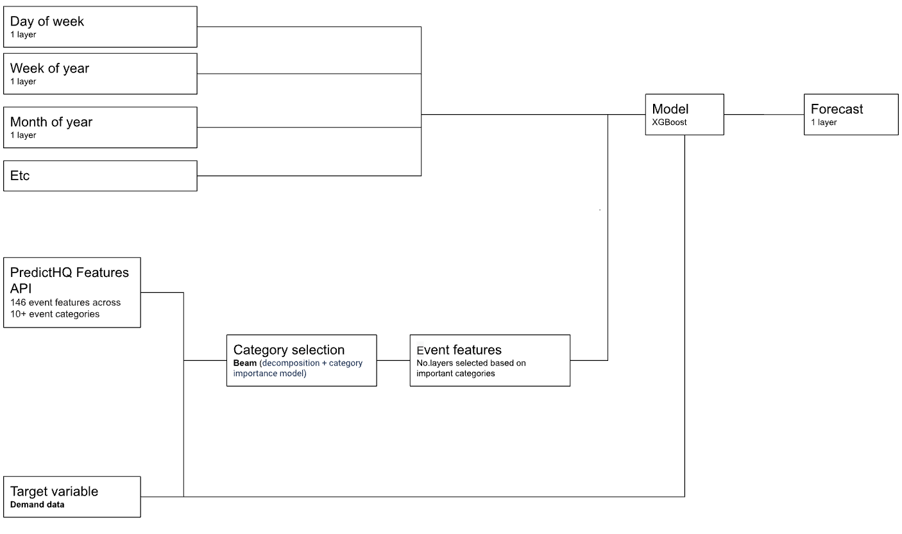

## Demand forecasting on Amazon SageMaker with PredictHQ's event data

The purpose of this code sample is to focus on how to use PredictHQ's event features and integrate them into your existing forecasting model, so we won't focus on how to tune, train, or cross-validate an XGBoost model. Although I am using Amazon Sagemaker and XGBoost model here, the model architecture is agnostic to ML platforms and forecasting algorithms.

## Architecture

## Access to PredictHQ's API and Dataset
Follow instructions at [Features API Page](https://docs.predicthq.com/start/features-api/) to request for an **ACCESS_TOKEN**, which is used to retrieve event features.
 
Dataset is available at https://aws.amazon.com/marketplace/seller-profile?id=b82dc088-06e8-4b0c-9068-42e35f9a099b

## Security

See [CONTRIBUTING](CONTRIBUTING.md#security-issue-notifications) for more information.

## License

This library is licensed under the MIT-0 License. See the LICENSE file.
